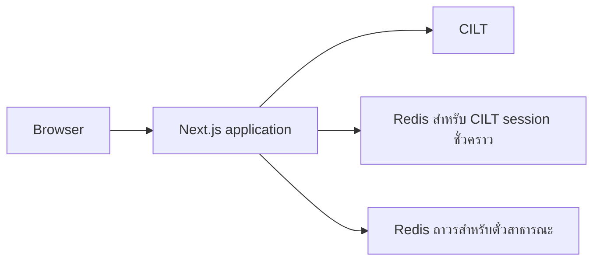

# WU CILT Assistant

เครื่องมือ open source สำหรับช่วยลดการกดขั้นตอนเดิม ๆ ในการประเมิน CILT ของนักศึกษามหาวิทยาลัยวลัยลักษณ์

**เว็บที่ใช้งานอยู่:** [wu-unl.likezara.com](https://wu-unl.likezara.com/)

**สัญญาอนุญาต:** [MIT](LICENSE)

**สถานะ:** ดูแลโดยชุมชน ไม่ใช่ระบบหรือโครงการอย่างเป็นทางการของมหาวิทยาลัยวลัยลักษณ์หรือ CILT

> เครื่องมือนี้มีไว้เพื่อความสะดวก ผู้ใช้ต้องตรวจสอบผลที่ CILT แสดงและรับผิดชอบการใช้งานของตนเอง

## จุดประสงค์และขอบเขต

โปรเจกต์นี้เกิดจากการต้องกรอกและกดตัวเลือกเดิมซ้ำ ๆ ไม่ได้มีเจตนาทำให้ CILT เสียหาย, ทำให้บริการของมหาวิทยาลัยล่ม, ข้ามการเข้าสู่ระบบ หรือหลีกเลี่ยงขั้นตอนประเมินปกติ

พัฒนาเพื่อการเรียนรู้และลดงานซ้ำ **อัปเดตล่าสุด: 27 กันยายน 2026**

- ผู้ใช้เข้าสู่ระบบด้วยบัญชี CILT ของตัวเอง และรับผิดชอบทุกการส่งแบบประเมิน
- โหมด Auto ทำทีละวิชาตามลำดับ และพัก 3 วินาทีก่อนวิชาถัดไป ไม่ส่งหลายวิชาพร้อมกัน
- ระบบตรวจ flow ที่ CILT ตอบกลับก่อนรายงานว่าสำเร็จ ไม่ถือว่าสำเร็จเพียงเพราะส่งคำขอจากเครื่องมือแล้ว
- ระบบไม่สแกนข้อมูลที่ไม่เกี่ยวกับ session ปัจจุบัน, ไม่รับไฟล์/ลิงก์ในตั๋ว และไม่มีช่องทางข้ามข้อจำกัดเพื่อส่งจำนวนมาก

## ความสามารถ

- เข้าสู่ CILT สำหรับ flow ที่กำลังใช้งานเท่านั้น
- แสดงรายการแบบประเมินและรายวิชา พร้อมตรวจ flow ฝั่งต้นทางก่อนรายงานผล
- **Pick** สำหรับเลือกและส่งแบบตั้งใจทีละวิชา
- **Auto** สำหรับหลายวิชา โดยทำงานเรียงลำดับและหน่วง 3 วินาทีระหว่างวิชา
- ตรวจกรณี CES ที่ระบุชั่วโมงศึกษาด้วยตนเองเป็น `0` จน CILT ไปต่อไม่ได้ อธิบายสาเหตุและแนะนำค่า `6` โดยให้ผู้ใช้เลือกหรือแก้ไขเองก่อนส่ง
- มีบอร์ดตั๋วสาธารณะแบบข้อความล้วน กรองประสบการณ์ด้วยคะแนน 1–5 ดาว เพื่อให้ทุกคนเห็นปัญหาที่ซ้ำกัน

## ความเป็นส่วนตัวและตั๋วสาธารณะ

ข้อมูลสองกลุ่มนี้มีวิธีจัดการต่างกันโดยตั้งใจ:

| ข้อมูล | วิธีจัดการ |
| --- | --- |
| รหัสนักศึกษาและรหัสผ่าน | ส่งไปยัง CILT ขณะทำคำขอ ไม่เก็บเป็นประวัติผู้ใช้หรือเขียนลงฐานข้อมูลของแอป |
| CILT session cookie | เก็บเฉพาะ Redis ฝั่ง server สูงสุด 15 นาทีเพื่อให้ flow ที่กำลังทำอยู่ไปต่อได้ Browser JavaScript อ่านค่าไม่ได้ |
| ข้อความตั๋ว | เป็นสาธารณะและเก็บถาวร ห้ามใส่ชื่อ, อีเมล, เบอร์โทร, รหัสนักศึกษา, รหัสผ่าน หรือ OTP |
| ไฟล์แนบและลิงก์ | ไม่รับ ตั๋วรับเฉพาะข้อความ |

ฟอร์มตั๋วปฏิเสธรูปแบบข้อมูลส่วนตัวที่พบบ่อย, ลิงก์, ไฟล์, รายงานซ้ำ, ข้อความซ้ำตัวอักษรมากผิดปกติ และการส่งเร็วเกินไป การตรวจเหล่านี้ช่วยลดความเสี่ยง แต่ไม่สามารถรับประกันได้ว่าจะตรวจพบข้อมูลละเอียดอ่อนทุกแบบ หากส่งข้อมูลส่วนตัวโดยไม่ตั้งใจ ให้ติดต่อ [contact@likezara.com](mailto:contact@likezara.com) โดยเร็ว

## โครงสร้างระบบ



Redis สองส่วนแยกจากกันโดยตั้งใจ: การเก็บตั๋วแบบถาวรต้องไม่ทำให้ CILT session cookie ถูกเก็บแบบถาวรไปด้วย

## เริ่มพัฒนาบนเครื่อง

### สิ่งที่ต้องมี

- [Bun](https://bun.sh/)
- Redis แยกอย่างน้อย 2 instance หรือฐานข้อมูลที่แยกกันจริง: ส่วนหนึ่งสำหรับ CILT session ชั่วคราว และอีกส่วนสำหรับตั๋วสาธารณะถาวร
- Browser สมัยใหม่

### ติดตั้ง

```bash
git clone https://github.com/KamaruSama/wu-cilt.git
cd wu-cilt
bun install --frozen-lockfile
cp .env.example .env.local
bun run dev
```

ตั้งค่าเฉพาะสำหรับเครื่องพัฒนาใน `.env.local` ก่อนเปิดใช้ ระบบตั๋วจะไม่ทำงานหากไม่มี `TICKET_RATE_SALT` ที่ยาวพอและรหัสผ่าน Ticket Redis ที่ตั้งไว้ อย่าใส่ข้อมูล CILT ของผู้ใช้ใน `.env.local`; ผู้ใช้กรอกเฉพาะในฟอร์มขณะใช้งาน

### ตรวจ build

```bash
bun run build
```

GitHub Actions ใน repo จะรัน build นี้ทุก Pull Request และทุก push ไป `main`

## Deploy

production ใช้ Docker และ K3s manifests

1. สร้าง Docker image จาก repo นี้
2. สร้างไฟล์สำหรับ deployment เท่านั้น `k3s-manifests/01-secrets.yaml` จาก `01-secrets.yaml.template` แล้วแทนค่า `REDIS_PASSWORD`, `TICKET_REDIS_PASSWORD` และ `TICKET_RATE_SALT` ด้วยค่าที่แข็งแรงและไม่ซ้ำกัน
3. ห้ามนำไฟล์ secret ที่สร้างแล้วเข้า Git — `.gitignore` ป้องกันไว้โดยตั้งใจ
4. apply namespace, Redis session, Redis สำหรับตั๋ว, service, deployment และ HTTPS ingress ใน cluster เป้าหมาย
5. ตรวจหน้า Home และรายการตั๋วโดยไม่สร้างตั๋วทดสอบหรือส่งแบบประเมิน CILT จริง

ห้ามคัดลอก production secret, CILT cookie, รหัสผู้ใช้ หรือรายละเอียดเข้าถึง cluster ไปไว้ใน issue หรือ Pull Request

## ร่วมพัฒนา

ยินดีให้ fork, ดัดแปลง และช่วยพัฒนาภายใต้ [MIT License](LICENSE) กรุณาอ่าน [CONTRIBUTING.md](CONTRIBUTING.md) และ [SECURITY.md](SECURITY.md) ก่อน

ทุก Pull Request ต้องผ่านการตรวจโดย maintainer ก่อน merge ใน repo มี `CODEOWNERS`, pull-request template และ CI อยู่แล้ว GitHub branch ruleset ของ `main` ควรบังคับให้ **Verify** ผ่าน, ต้องมี code-owner review และปิด auto-merge

## ความปลอดภัยของ repository

repo สาธารณะตั้งใจไม่เผยแพร่:

- ไฟล์ `.env*` ทั้งหมด ยกเว้น `.env.example` ที่ไม่มีค่าจริง
- K3s secret manifest ที่สร้างจริง
- backup, deployment notes, test log, assistant settings และ debug scripts บนเครื่อง
- dependencies และ build output

ก่อนเผยแพร่การเปลี่ยนแปลงใหม่ ให้ตรวจ staged files และ scan secret เสมอ การเปิด source code ไม่ได้ทดแทนการตั้งค่า deployment ที่ปลอดภัย
